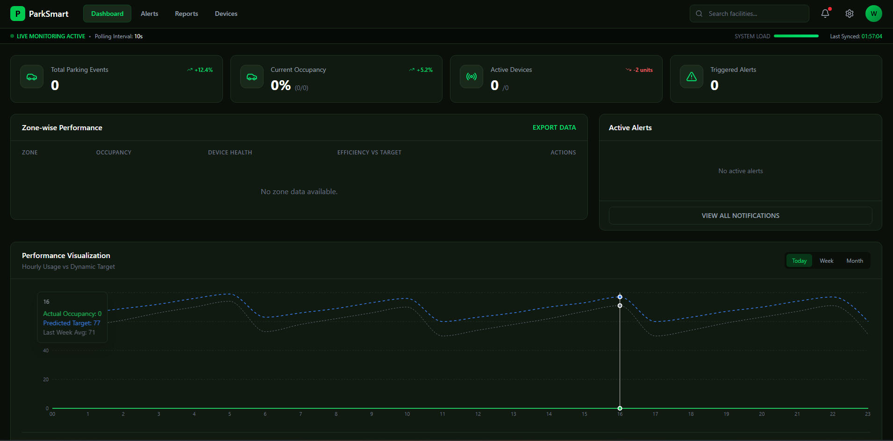

# Smart Car Parking Monitoring & Alert System

A full-stack IoT-enabled car parking system with real-time monitoring, alerts, and analytics.



## � Documentation

- **[📖 API Documentation](API_DOCUMENTATION.md)** - Complete API reference with endpoints, request/response formats, and examples

## �🚀 Features

### Backend (Django + DRF)
- **RESTful APIs** for Facilities, Zones, Devices, and Alerts.
- **Telemetry Ingestion**: Handle singe and bulk telemetry data from IoT devices.
- **Alert Detection**: Real-time logic for Overstay, Offline, and Health alerts.
- **Analytics**: Aggregated stats for dashboard and hourly usage reports.
- **PostgreSQL**: Robust relational database for structured data.

### Frontend (React + TypeScript + Vite)
- **Real-time Dashboard**: Live occupancy rates and health status.
- **Monitoring**: Filterable device list with status badges.
- **Alert Management**: View and acknowledge system alerts.
- **Reports**: Hourly usage trends and efficiency targets visualised with Recharts.
- **Export**: Download reports as CSV, Excel, or PDF.

## 🛠️ Tech Stack

- **Backend**: Python 3.10+, Django 5.x, Django REST Framework, PostgreSQL
- **Frontend**: React 19, TypeScript, Tailwind CSS, React Query, Recharts, Axios
- **Tools**: Vite, PostCSS, Lucide React

## 📦 Setup Instructions

### Backend Setup

1.  **Clone the repository**:
    ```bash
    git clone <repo-url>
    cd smart-parking-system/backend
    ```

2.  **Create and activate a virtual environment**:
    ```bash
    python -m venv venv
    # Windows
    venv\Scripts\activate
    # Mac/Linux
    source venv/bin/activate
    ```

3.  **Install dependencies**:
    ```bash
    pip install -r requirements.txt
    ```

4.  **Configure Environment**:
    - Create a `.env` file in `smart_parking/` (next to `settings.py`) or use system env vars.
    - Set `DATABASE_URL` for PostgreSQL.
    - Set `SECRET_KEY` and `DEBUG=True`.

5.  **Run Migrations**:
    ```bash
    python manage.py migrate
    ```

6.  **Seed Data** (Optional):
    ```bash
    python manage.py seed_data
    ```

7.  **Run Server**:
    ```bash
    python manage.py runserver
    ```

### Frontend Setup

1.  **Navigate to frontend**:
    ```bash
    cd ../frontend
    ```

2.  **Install dependencies**:
    ```bash
    npm install
    ```

3.  **Run Development Server**:
    ```bash
    npm run dev
    ```
    Access the app at `http://localhost:5173`.

## 🏗️ Scalability Thought Exercise

**Scenario**: The system needs to scale to handle thousands of parking zones and millions of devices.

**Proposed Strategy**:

1.  **Database Optimization & Sharding**:
    - **Time-Series Partitioning**: Partition `TelemetryData` and `ParkingLog` tables by date (e.g., monthly) to keep index sizes manageable and queries fast.
    - **Read Replicas**: Offload heavy read operations (Dashboard, Reports) to read replicas, keeping the primary DB free for write-heavy ingestion.
    - **Sharding**: If a single DB instance hits limits, shard data by `Facility` or `Zone`.

2.  **Ingestion Layer**:
    - **Message Queue (Kafka/RabbitMQ)**: Decouple the HTTP ingestion API from the database. POST requests push to a queue; background workers (Celery/stateless consumers) process the queue to insert into DB and check for alerts. This handles traffic spikes gracefully.
    - **Edge Computing**: Filters noise at the gateway level (e.g., only send data when state *changes* or send heartbeats less frequently) to reduce backend load.

3.  **Caching Strategy**:
    - **Redis Cluster**: Cache aggregated dashboard stats (`DashboardSummary`, `HourlyUsage`) and invalidate only when relevant events occur (or use short TTLs e.g., 10s).
    - **Device State Cache**: Keep "Last Seen" and "Current Status" in Redis for ultra-fast lookup during monitoring, writing to DB only asynchronously for persistence.

4.  **Frontend & API**:
    - **Load Balancer**: Distribute API traffic across multiple stateless Django application servers (e.g., Gunicorn/Uvicorn behind Nginx/AWS ALB).
    - **WebSockets**: Replace polling (currently 10s interval) with WebSockets (Django Channels) to push real-time updates to the frontend, reducing server load from constant HTTP GET requests.
    - **CDN**: Serve static assets (React build) via CloudFront/Cloudflare.

5.  **Infrastructure**:
    - **Containerization (Docker/K8s)**: Deploy services in containers managed by Kubernetes to auto-scale ingestion workers and API pods based on CPU/Memory usage.
